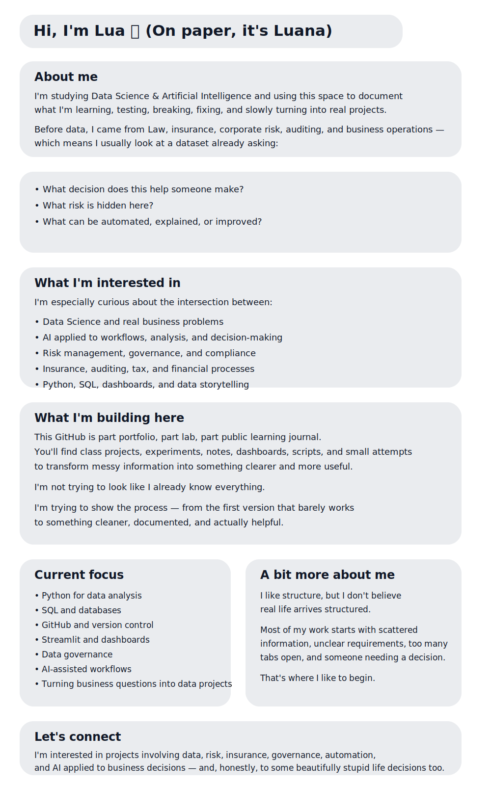

# Hi there 👋

## About me

I'm studying Data Science & Artificial Intelligence and using this space to document what I'm learning, testing, breaking, fixing, and slowly turning into real projects.

Before data, I came from Law, insurance, corporate risk, auditing, and business operations — which means I usually look at a dataset already asking:

**What decision does this help someone make?**  
**What risk is hidden here?**  
**What can be automated, explained, or improved?**

## What I'm interested in

I'm especially curious about the intersection between:

- Data Science and real business problems
- AI applied to workflows, analysis, and decision-making
- Risk management, governance, and compliance
- Insurance, auditing, tax, and financial processes
- Python, SQL, dashboards, and data storytelling

## What I'm building here

This GitHub is part portfolio, part lab, part public learning journal.

You'll find class projects, experiments, notes, dashboards, scripts, and small attempts to transform messy information into something clearer and more useful.

I'm not trying to look like I already know everything.

I'm trying to show the process — from the first version that barely works to something cleaner, documented, and actually helpful.

## Current focus

- Python for data analysis
- SQL and databases
- GitHub and version control
- Streamlit and dashboards
- Data governance
- AI-assisted workflows
- Turning business questions into data projects

## A bit more about me

I like structure, but I don't believe real life arrives structured.

Most of my work starts with scattered information, unclear requirements, too many tabs open, and someone needing a decision.

That's where I like to begin.

## Let's connect

I'm interested in projects involving data, risk, insurance, governance, automation, and AI applied to business decisions — and, honestly, to some beautifully stupid life decisions too.

I'm excited to be on this journey, learning in public and enjoying the process.

Feel free to follow along.
